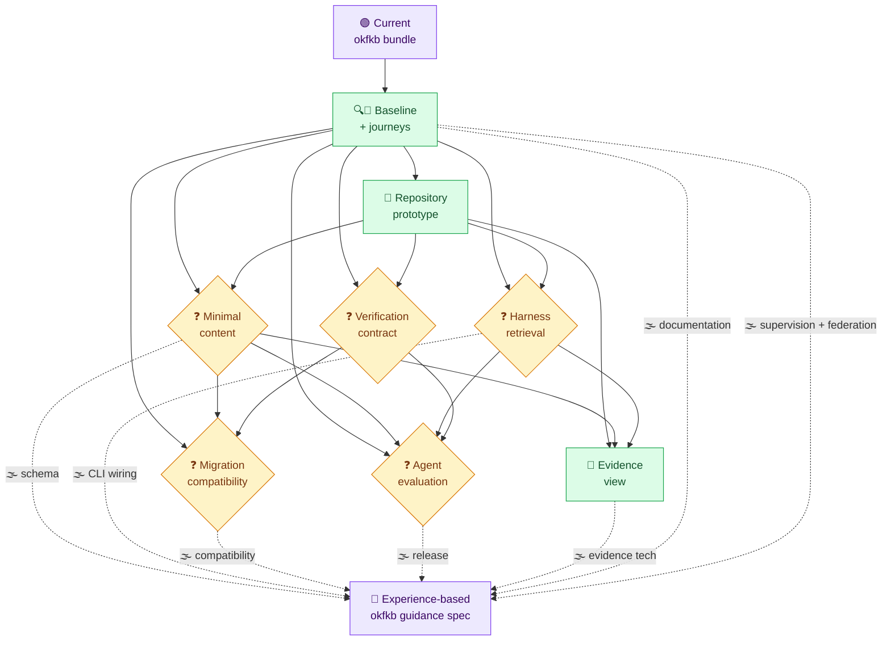

# Mermaid map preview

This fixture exercises the Mermaid graph used by the OKF knowledge-base planning map.

```mermaid
flowchart TD
  S["🟢 Current<br>okfkb bundle"] --> F["🔍🧭 Baseline<br>+ journeys"]
  F --> P["🧪 Repository<br>prototype"]
  F --> M{"❓ Minimal<br>content"}
  F --> H{"❓ Harness<br>retrieval"}
  F --> V{"❓ Verification<br>contract"}
  F --> G{"❓ Migration<br>compatibility"}
  F --> E{"❓ Agent<br>evaluation"}
  P --> M
  P --> H
  P --> V
  P --> X["🧪 Evidence<br>view"]
  M --> X
  H --> X
  M --> G
  V --> G
  M --> E
  H --> E
  V --> E
  M -.->|🌫️ schema| Z
  H -.->|🌫️ CLI wiring| Z
  G -.->|🌫️ compatibility| Z
  E -.->|🌫️ release| Z
  X -.->|🌫️ evidence tech| Z
  F -.->|🌫️ documentation| Z
  F -.->|🌫️ supervision + federation| Z
  Z["🏁 Experience-based<br>okfkb guidance spec"]

  classDef context fill:#ede9fe,stroke:#7c3aed,color:#3b0764
  classDef process fill:#dbeafe,stroke:#2563eb,color:#1e3a8a
  classDef decision fill:#fef3c7,stroke:#d97706,color:#78350f
  classDef ticket fill:#dcfce7,stroke:#16a34a,color:#14532d
  classDef fog fill:#f3f4f6,stroke:#6b7280,color:#1f2937

  class S,Z context
  class F,P,X ticket
  class M,H,V,G,E decision
```
