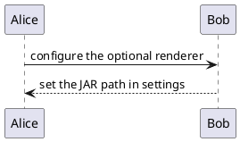

# PlantUML success preview

PlantUML renders through the optional external executable available on `PATH` in this
environment. The source remains available below for the source-mapping check.

```plantuml
@startuml
Alice -> Bob: configure the optional renderer
Bob --> Alice: set the JAR path in settings
@enduml
```
