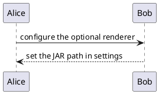

# PlantUML success preview

PlantUML renders through the optional external executable available on `PATH` in this
environment. The source stays in the page and shows only when the diagram fails.

```plantuml
@startuml
Alice -> Bob: configure the optional renderer
Bob --> Alice: set the JAR path in settings
@enduml
```
